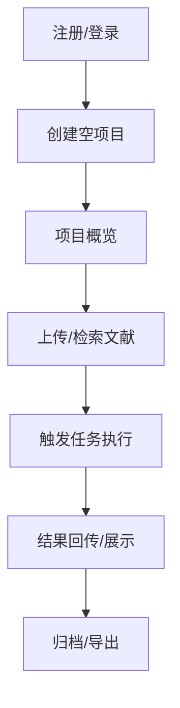

# VibeSearch 全量开发计划与详细设计

> 文档版本：2025-09-19<br/>
> 维护人：Codex 开发团队

---

## 1. 项目背景与目标

- **产品定位**：VibeSearch 旨在为科研团队提供集项目管理、文献采集、自动化任务编排与智能分析于一体的全流程平台。
- **近期目标**：完成「项目中心 + 三模式研究流」改造，支撑公网环境下的真实用户访问，并确保移动端最小可用体验 (MVP)。
- **上线门槛**：
  - 前端/后端/E2E 全量测试套件通过。
  - 核心项目流（注册登录 → 创建项目 → 导入/检索文献 → 触发研究任务 → 归档）成功率 ≥ 98%。
  - 对公网拓扑的远程访问（154.12.50.153）无跨域/鉴权异常。

## 2. 范围与成功标准

| 范畴 | 最低要求 | 额外加分 | 成功验证方式 |
| --- | --- | --- | --- |
| 后端 API | 支持项目 CRUD、文献采集、任务执行三大域；统一 CORS | 引入性能监控、任务流回放 | `pytest` + `scripts/run_full_system_suite.sh` |
| 前端 UI | 桌面端 Sidebar 架构、项目中心、研究工作台 | 深色模式、移动端抽屉导航 | `npm run build` + Playwright `tests/playwright/*.spec.ts` |
| 移动端适配 | 断点 < `lg` 时使用 Drawer、栅格重排 | 双栏可折叠统计卡片、手势优化 | 手工验收 + Lighthouse |
| 数据源合规 | 所有文献来源统一显示 Semantic Scholar | 后续接入二方数据源 (Google Scholar 等) | API 回归脚本对 `source_platform` 字段断言 |

## 3. 当前完成状态快照

- **公网联调**：`frontend/src/services/api/client.ts` 默认基址已指向 `http://154.12.50.153:8000`，Playwright 远端模式读取同源变量。后端在 `app/main.py:280` 扩充了 CORS 白名单。
- **项目中心重构**：新增 `frontend/src/pages/projects/` 目录，`project-list-page.tsx` 提供分状态卡片、动画过渡、空态引导；`project-layout.tsx` 负责加载项目上下文；`project-overview-page.tsx` 整合快捷入口与统计指标。
- **子路由拆分**：`frontend/src/router/routes.tsx` 挂载 `/projects/:projectId` 嵌套路由，工作台、文献、任务与设置分别代理至原有页面。
- **状态管理**：`frontend/src/stores/app.store.ts` 统一维护 `currentProject`、`availableProjects`，并在 `setCurrentProject` 时创建会话占位。
- **移动端适配**：`frontend/src/components/layout/AppLayout.tsx` 使用 `Grid.useBreakpoint` 与 `Drawer` 构建移动菜单；`ProjectListPage`、`LibraryPage` 等页面以 `Col xs={24}` 等配置保证窄屏换行。
- **数据来源一致性**：`frontend/src/pages/library/library-page.tsx` 对 `source_platform` 进行判定，默认展示为 “Semantic Scholar”；后端 `app/services/research_rabbit_client.py` 继续走 Semantic Scholar 数据。
- **测试基线**：`npx tsc --noEmit`、`npm run build`、`pytest`、`scripts/run_full_system_suite.sh` 最新一次均通过；Playwright 回归中导航场景复绿。

## 4. 开发路线图（四周滚动计划）

### Phase 0 · 基础设施稳固（进行中）
- [x] 固化前端 `axios` 基址与 CORS 白名单。
- [x] 统一文献来源展示为 Semantic Scholar。
- [ ] 将 `.env` 模板补充公网环境变量（API 基址、静态资源域名）。
- [ ] 编写 `scripts/smoke_remote.sh`，用于公网服务健康探测。

### Phase 1 · 项目工作台完备
- [x] 构建项目列表与概览骨架。
- [ ] `ProjectWorkspacePage` 与 `ResearchWorkspace` 联调：使用 `projectId` 过滤对话、任务。
- [ ] `ProjectLiteraturePage` 加载当前项目数据 → 表格/卡片双视角。
- [ ] `ProjectTasksPage` 接入任务统计 API (`app/api/enhanced_tasks.py`)。
- [ ] `ProjectSettingsPage` 保存成功后回写 Zustand 状态。

### Phase 2 · 三模式研究流程
- [ ] 后端：补齐 `app/services/research_orchestrator.py` 对浅/深/自动三模式的任务转换。
- [ ] 前端：在 `ResearchWorkspace` 中暴露模式选择器、费用预估条。
- [ ] 日志：任务触发脚本写入 `artifacts/system_tests/<run_id>/`。

### Phase 3 · 移动端体验 & UI 精炼
- [ ] Sidebar 收拢动画优化，切换项目时保留滚动位置。
- [ ] 项目列表卡片在 `xs` 断点下收缩为纵向步骤条。
- [ ] 引入 `tailwind.config.js` 自定义断点别名（`laptop`, `tablet`, `phone`）。
- [ ] 增加触控反馈（按钮高度、点击区域）。

### Phase 4 · 可观测性与 CI 准入
- [ ] `scripts/run_full_system_suite.sh` 输出 JUnit 和 HTML 汇总。
- [ ] GitHub Actions 增加夜间触发，调用完整系统套件。
- [ ] Prometheus/Grafana 仪表盘引用后端指标（请求数、失败率、延迟分位）。

## 5. 详细设计

### 5.1 后端设计

#### 5.1.1 架构概览
- **路由组织**：FastAPI 按领域拆分模块，项目相关逻辑集中在 `app/api/project.py`；文献、任务、分析分别对应各自路由。
- **数据层**：SQLAlchemy 模型位于 `app/models/`，对应的 Pydantic Schema 存放于 `app/schemas/`，确保 ORM 与返回结构解耦。
- **配置管理**：`app/core/config.py` 使用 `pydantic-settings`，支持 `.env` 与环境变量覆盖，内建 Semantic Scholar、ResearchRabbit 等配置项。

#### 5.1.2 项目域
- `POST /api/project/create-empty`：创建占位项目，返回 `ProjectResponse`（含 `status`、`literature_count` 等扩展字段）。
- `GET /api/project/list`：按创建时间倒序返回当前用户的所有项目，并计算 `literature_count`。
- `PUT /api/project/{id}`：更新名称、描述等基础信息，供前端设置页使用。
- 最终状态：项目状态字段可选值包括 `empty/active/completed/archived/pending/processing`，前端通过 `castProjectStatus`（`frontend/src/services/api/project.ts`）映射。

#### 5.1.3 鉴权与 CORS
- 使用 `app/core/security.py` 提供 JWT 校验，所有项目路由走 `Depends(get_current_active_user)`。
- `app/main.py:280` 配置了公网白名单，允许来自 `http://154.12.50.153`、`*:3000`、`*:5173` 的跨域请求。
- HTTP 超时由 `TimeoutMiddleware` 限制为 15s，防止外部请求长时间占用。

#### 5.1.4 数据源策略
- ResearchRabbit 客户端（`app/services/research_rabbit_client.py`）仍负责向 Semantic Scholar 网关检索文献，并填充 `paper.get("paperId")` 等字段。
- 前端展示层仅显示 Semantic Scholar，避免误导用户以为拥有多源能力。

### 5.2 前端设计

#### 5.2.1 技术栈
- React 18 + TypeScript + Vite。
- UI 组件库 Ant Design (`antd`)，搭配 TailwindCSS 用于快速布局。
- 状态管理采用 Zustand（`frontend/src/stores/`）。
- 网络层统一通过 Axios 封装（`frontend/src/services/api/client.ts`）。

#### 5.2.2 布局与导航
- 顶级布局文件 `frontend/src/components/layout/AppLayout.tsx`：
  - 桌面端：使用 `Layout.Sider` 渲染主侧栏，根据是否在项目上下文切换菜单项。
  - 移动端：`Grid.useBreakpoint` 判断断点，触发 `Drawer` 菜单，将相同菜单渲染为抽屉。
  - 动画：`framer-motion` 提供折叠/展开动效。
  - 用户入口：头像 Dropdown，支持主题切换（保留挂钩 `darkMode` 状态）。

#### 5.2.3 项目中心
- `ProjectListPage`：
  - 数据：`projectAPI.getProjects()` → `setAvailableProjects` 缓存。
  - UI：按状态 (`project.status`) 分组，使用 `motion.div` 逐卡片淡入；统计卡片展示项目总数、文献合计、进行中任务数量。
  - 操作：支持刷新、创建空项目。创建后自动导航至 `/projects/{id}/overview`。
- `ProjectOverviewPage`：
  - 初始状态从 `useAppStore.currentProject` 填充，异步更新时对齐 `Project` 类型（含 `name` 字段）。
  - 展示项目描述、统计信息、快捷导航（工作台、文献、任务）。
  - 未来扩展：研究进度可接入 `progress_percentage`。
- `ProjectLayout`：
  - 守卫逻辑，确保 `projectId` 合法后加载项目详情，失败则跳回 `/projects`。
  - 在组件卸载时清空 `currentProject`，防止脏数据。

#### 5.2.4 子模块复用
- 研究工作台 (`ProjectWorkspacePage`) 直接复用原 `ResearchWorkspace`，通过 prop 传入 `projectId`。
- 文献库/任务页面同理，锁定当前项目避免用户切换错误上下文。

#### 5.2.5 响应式策略
- 栅格：Ant Design `Col xs={24} md={12} xl={8}` 保证不同断点自适应。
- 移动抽屉：在 `isMobile` 状态下点击汉堡按钮打开 Drawer；菜单项选择后自动关闭。
- 表格→卡片切换：`LibraryPage` 支持卡片与列表视图，卡片布局适合移动端滚动。

#### 5.2.6 网络与错误处理
- Axios 实例 (`frontend/src/services/api/client.ts`)：
  - `resolveBaseUrl` 优先读取 `VITE_API_BASE_URL`，为空时回落公网 IP。
  - Request 拦截器注入 `Authorization` 头；Response 拦截器在 401/403 时清空凭据并重定向 `/auth`。
- API 层：`projectAPI` 定义 `Project`、`ProjectSummary`、`CreateEmptyProjectPayload` 等类型，统一 `normalizeProject`。

### 5.3 集成流程



- 注册登录：前端 Playwright 脚本验证用户名+密码流程，后端返回 422 时记录响应体。
- 文献检索：调用 `/api/literature/search`，结果源统一为 Semantic Scholar。
- 任务执行：`/api/tasks/dispatch` 进行异步任务调度；WebSocket 渠道推送进度。
- 数据持久化：任务完成后写入 `artifacts/system_tests/<run_id>/integration/api_regression.json`。

## 6. 测试与质量保证

| 层级 | 工具/脚本 | 触发方式 | 产出物 |
| --- | --- | --- | --- |
| 单元 | `pytest` | `pytest` | `artifacts/.../backend/pytest.log` |
| 集成 | `scripts/api_regression_suite.py` | `python scripts/api_regression_suite.py --mode remote` | `integration/api_regression.json` |
| 前端 | Playwright | `npm run test:e2e` | `frontend/playwright.log`, `playwright-report/` |
| 端到端 | `scripts/run_full_system_suite.sh` | 手动 & CI | `summary.log`, `REGRESSION_PROOF.md` |

- **失败回收要求**：若任何阶段失败，需保留日志、`error-context.md`、浏览器控制台输出以及对应 API 响应体。
- **远程探活**：补充 `scripts/smoke_remote.sh`（规划中）每小时探测 `GET /api/health`、`GET /api/project/list`。
- **阈值监控**：CI 中 Playwright 失败率 > 5% 自动阻断部署。

## 7. 部署与运维注意事项

- **环境变量**：
  - `VITE_API_BASE_URL`：前端构建时写入公网 API 地址。
  - `JWT_SECRET_KEY`、数据库凭据务必通过 `.env` 或容器机密注入。
- **静态资源**：`npm run build` 输出 `frontend/dist`，部署到 CDN 或 Nginx；后端保留 `/uploads` 静态挂载。
- **服务拓扑**：推荐架构：Nginx → 前端静态资源 + 反向代理 `/api/` → FastAPI (Uvicorn/Gunicorn) → MySQL/Redis/Elasticsearch。
- **日志归档**：后端 Loguru 输出建议写入 `/var/log/vibereserch/backend.log`，并使用 logrotate。

## 8. 风险评估与缓解

| 风险 | 影响 | 当前缓解措施 | 后续建议 |
| --- | --- | --- | --- |
| 项目路由尚未完成数据绑定 | 工作台数据缺失 | 页面骨架已就绪，API 待接入 | Phase 1 优先完成 `projectId` 透传 |
| 移动端交互不充分 | 外出使用体验差 | Drawer 菜单已上线 | Phase 3 增补触控手势/组件尺寸 |
| Semantic Scholar 速率限制 | 文献检索失败 | `AsyncLimiter` 控制每分钟请求数 | 与官方申请更高配额，增加缓存 |
| 测试套件耗时长 | CI 周期变慢 | 日志分层、分阶段执行 | 引入并行执行与缓存依赖 |

## 9. 下一步行动（优先级倒序）

1. **联调项目工作台数据**：完善 `ProjectWorkspacePage`、`ProjectTasksPage`，确保项目上下文贯通。
2. **编写远程冒烟脚本**：交付 `scripts/smoke_remote.sh` 与说明，供运维定时执行。
3. **增强移动端体验**：按照 Phase 3 计划完成断点优化与触控体验。
4. **CI 集成完整系统套件**：打通 GitHub Actions 夜间任务，沉淀测试产出。

## 10. 附录

### 10.1 关键文件索引

- 前端路由：`frontend/src/router/routes.tsx`
- 布局组件：`frontend/src/components/layout/AppLayout.tsx`
- 项目列表：`frontend/src/pages/projects/project-list-page.tsx`
- 项目概览：`frontend/src/pages/projects/project-overview-page.tsx`
- API 客户端：`frontend/src/services/api/client.ts`
- 项目接口封装：`frontend/src/services/api/project.ts`
- 状态管理：`frontend/src/stores/app.store.ts`
- 后端项目路由：`app/api/project.py`
- 后端配置：`app/core/config.py`
- CORS 与应用入口：`app/main.py`

### 10.2 数据模型摘要

| 实体 | 关键字段 | 说明 |
| --- | --- | --- |
| Project (`app/models/project.py`) | `name`, `description`, `status`, `metadata` | 存储项目核心信息及扩展元数据 |
| Literature (`app/models/literature.py`) | `source_platform`, `semantic_id`, `quality_score` | 支撑文献库展示与排序 |
| Task (`app/models/task.py`) | `mode`, `status`, `progress` | 对应三种研究模式任务流 |

### 10.3 参考测试命令

```bash
# 后端
pytest

# 前端类型检查
cd frontend && npx tsc --noEmit

# 前端构建
cd frontend && npm run build

# 全链路测试
./scripts/run_full_system_suite.sh --run-id "$(date +%Y%m%d_%H%M%S)"
```

---
如需补充或修订，请在 PR 中更新本文档并在标题加入 `[docs]` 标识。
