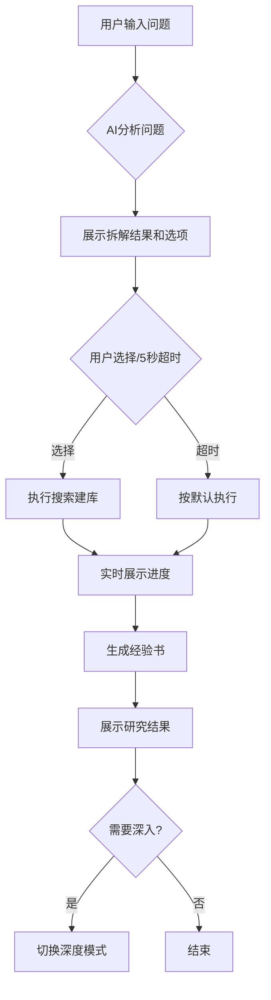
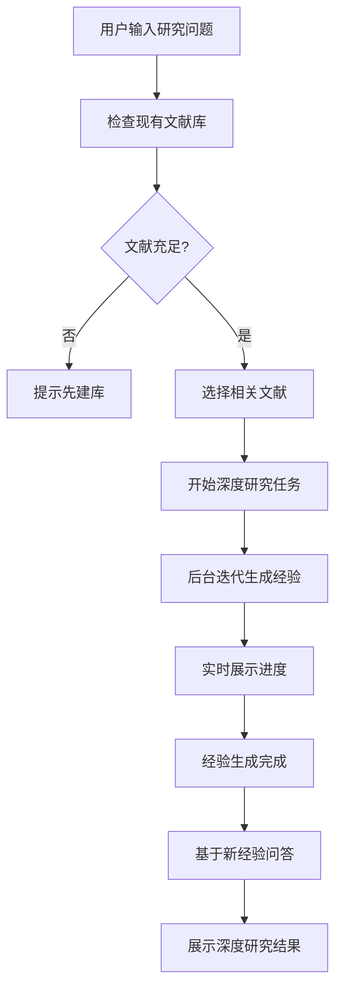

# 科研文献智能分析平台 - 系统分析与改进计划

## 一、愿景与现状对比分析

### 1.1 愿景概述
- **核心目标**：深度研究AI平台，利用AI agent调度能力和信息收集/提取方法执行研究功能
- **三种运行模式**：
  - RAG模式：从知识库搜索内容，结合问题向LLM提问
  - 深度研究模式：针对特定问题生成新经验
  - 全自动模式：AI agent自主调度，扩展知识库
- **原子化建库流程**：搜索→下载PDF→转Markdown→清洁化处理→生成主经验
- **即时交互能力**：类似天工Skywork，提供选项供用户选择，5秒无响应则自动继续

### 1.2 现有实现的优势
✅ **后端架构完善**
- 三种研究模式API已实现（/api/research/query）
- MCP工具注册和调用机制已建立
- 完整的搜索建库原子化流水线（SearchAndBuildLibraryService）
- 后台任务系统已实现（Task模型和Celery集成）
- 智能交互API已实现（InteractionSession和ClarificationCard）
- WebSocket实时进度推送机制已建立

✅ **核心功能实现**
- Research Rabbit API集成用于文献搜索
- PDF处理和Markdown转换功能完成
- 轻量化结构化处理服务已实现
- 经验生成机制已建立（MainExperience模型）
- Elasticsearch向量检索已集成

### 1.3 与愿景的差距

❌ **前端系统完全缺失**
- 无用户界面，所有功能仅能通过API调用
- 无法展示实时进度和任务状态
- 智能交互选项无法展示给用户
- 文献库管理界面缺失

❌ **用户交互体验未实现**
- 5秒超时自动选择机制有API但无界面
- 问题拆解结果无法展示给用户
- 缺少对话式交互界面
- 无法上传PDF或导入Zotero文献库

❌ **模式切换不够智能**
- 三种模式需要用户手动选择
- 缺少根据问题复杂度自动选择模式的机制
- 模式间的切换逻辑不够清晰

### 1.4 系统矛盾之处

⚠️ **架构问题**
1. Claude Code MCP集成与实际MCP工具调用关系不清晰
2. 经验生成逻辑分散在多个服务中，缺少统一管理
3. 研究模式的边界定义不够明确
4. 原子化工具的粒度控制不一致

## 二、后端改进计划

### 2.1 优化MCP工具集成（优先级：高）
```python
# 需要改进的文件：
# app/services/mcp_tool_setup.py
# app/services/research_orchestrator.py

改进内容：
1. 明确定义MCP工具的调用边界
2. 实现更多原子化工具：
   - upload_pdf_batch：批量PDF上传处理
   - import_from_zotero：Zotero文献库导入
   - import_from_doi：DOI批量导入
3. 优化Claude Code编排逻辑
```

### 2.2 统一经验生成服务（优先级：中）
```python
# 创建新服务：
# app/services/unified_experience_service.py

功能：
1. 统一管理主经验和深度研究经验
2. 实现经验迭代算法（5轮迭代，每轮5篇）
3. 提供经验缓存和更新机制
```

### 2.3 智能模式选择器（优先级：中）
```python
# 创建新服务：
# app/services/mode_selector_service.py

功能：
1. 分析用户问题复杂度
2. 自动推荐合适的研究模式
3. 提供模式切换建议
```

## 三、前端架构方案

### 3.1 技术栈选择
- **框架**：React 18 + TypeScript
- **UI组件库**：Ant Design 5.0 + Tailwind CSS
- **状态管理**：Zustand（轻量级）+ React Query（数据获取）
- **实时通信**：Socket.io Client
- **动画**：Framer Motion + Lottie
- **图表**：ECharts + D3.js（知识图谱可视化）
- **路由**：React Router v6
- **构建工具**：Vite

### 3.2 核心模块设计

#### 3.2.1 研究工作台（Research Workspace）
```
页面路径：/workspace
核心功能：
- 智能问答输入框（支持Markdown）
- 模式选择器（RAG/深度/全自动）
- 实时进度展示面板
- 智能交互卡片组件
- 结果展示区域
```

#### 3.2.2 文献库管理（Literature Library）
```
页面路径：/library
核心功能：
- 文献列表展示（表格/卡片视图）
- 批量上传PDF
- DOI批量导入
- Zotero导入
- 文献详情查看
- 结构化数据编辑
```

#### 3.2.3 任务中心（Task Center）
```
页面路径：/tasks
核心功能：
- 任务列表（进行中/已完成）
- 实时进度条
- 任务详情展示
- 成本统计
- 任务日志查看
```

#### 3.2.4 智能交互组件（Smart Interaction）
```
组件位置：全局悬浮
核心功能：
- 动态选项卡片
- 5秒倒计时提示
- 自定义输入框
- 选择历史记录
- 智能推荐标识
```

### 3.3 核心组件详细设计

#### 3.3.1 智能问答组件
```typescript
interface SmartQueryProps {
  onSubmit: (query: string, mode: ResearchMode) => void;
  onModeChange: (mode: ResearchMode) => void;
  initialMode?: ResearchMode;
}

功能要求：
1. 支持Markdown输入和预览
2. 智能提示历史问题
3. 问题模板快速选择
4. 模式自动推荐
5. 支持附加上下文（选择相关文献）
```

#### 3.3.2 交互卡片组件
```typescript
interface InteractionCardProps {
  question: string;
  options: Option[];
  recommendedId: string;
  timeoutSeconds: number;
  onSelect: (optionId: string) => void;
  onTimeout: () => void;
  onCustomInput?: (input: string) => void;
}

设计要求：
1. Material Design 3风格
2. 推荐选项高亮显示
3. 倒计时进度环
4. 平滑过渡动画
5. 响应式布局
```

#### 3.3.3 实时进度组件
```typescript
interface ProgressTrackerProps {
  taskId: string;
  stages: ProgressStage[];
  currentStage: number;
  progress: number;
  estimatedTime?: number;
  onCancel?: () => void;
}

功能特性：
1. 步骤式进度展示
2. 实时百分比更新
3. 预计剩余时间
4. 详细日志折叠面板
5. 暂停/继续/取消操作
```

### 3.4 页面流程设计

#### 3.4.1 全自动模式流程


#### 3.4.2 深度研究模式流程


### 3.5 用户体验设计原则

#### 3.5.1 简洁而不简陋（全自动模式）
- 单一输入框作为主要交互
- 智能推荐减少用户选择
- 自动化流程减少操作步骤
- 清晰的进度反馈

#### 3.5.2 强大而不繁琐（深度研究模式）
- 高级选项默认折叠
- 批量操作支持
- 键盘快捷键
- 拖拽交互

#### 3.5.3 设计哲学
- **渐进式披露**：基础功能直接可见，高级功能逐步展现
- **智能默认值**：根据使用习惯自动设置参数
- **即时反馈**：所有操作都有视觉/声音反馈
- **容错设计**：支持撤销、恢复、重试

### 3.6 动画和交互细节

#### 3.6.1 微交互动画
```typescript
// 使用Framer Motion实现
const cardVariants = {
  hidden: { opacity: 0, y: 20 },
  visible: {
    opacity: 1,
    y: 0,
    transition: {
      type: "spring",
      damping: 25,
      stiffness: 500
    }
  },
  exit: { opacity: 0, x: 100 }
};
```

#### 3.6.2 加载状态
- 骨架屏加载
- 渐进式内容显示
- Lottie动画提示

#### 3.6.3 交互反馈
- 按钮点击波纹效果
- 卡片悬停阴影变化
- 拖拽时的视觉提示
- 成功/失败的Toast提示

## 四、API接口对接清单

### 4.1 研究模式相关
| API端点 | 方法 | 功能 | 前端使用场景 |
|---------|------|------|-------------|
| /api/research/query | POST | 执行研究查询 | 智能问答提交 |
| /api/interaction/start | POST | 启动智能交互 | 开始交互式研究 |
| /api/interaction/{id}/select | POST | 用户选择选项 | 交互卡片选择 |
| /api/interaction/{id}/timeout | POST | 超时自动选择 | 5秒超时处理 |
| /api/interaction/{id}/custom | POST | 自定义输入 | 用户自由输入 |

### 4.2 文献管理相关
| API端点 | 方法 | 功能 | 前端使用场景 |
|---------|------|------|-------------|
| /api/literature/upload | POST | 上传PDF | 文献上传 |
| /api/literature/import-doi | POST | DOI导入 | 批量DOI导入 |
| /api/literature/import-zotero | POST | Zotero导入 | 导入文献库 |
| /api/literature/list | GET | 文献列表 | 文献库展示 |
| /api/literature/{id} | GET | 文献详情 | 查看详情 |

### 4.3 任务管理相关
| API端点 | 方法 | 功能 | 前端使用场景 |
|---------|------|------|-------------|
| /api/tasks/list | GET | 任务列表 | 任务中心 |
| /api/tasks/{id}/status | GET | 任务状态 | 实时进度 |
| /api/tasks/{id}/cancel | POST | 取消任务 | 任务控制 |
| /ws/task-progress | WS | 实时进度 | WebSocket连接 |

## 五、实施计划

### 第一阶段：后端优化（1周）
1. 完善MCP工具注册
2. 实现文献导入API
3. 优化智能交互逻辑
4. 测试WebSocket通信

### 第二阶段：前端基础架构（1周）
1. 搭建React项目框架
2. 配置路由和状态管理
3. 实现基础布局组件
4. 集成WebSocket客户端

### 第三阶段：核心功能开发（2周）
1. 智能问答界面
2. 交互卡片组件
3. 实时进度展示
4. 文献库管理

### 第四阶段：高级功能（1周）
1. 知识图谱可视化
2. 批量操作优化
3. 高级搜索过滤
4. 数据导出功能

### 第五阶段：优化和测试（1周）
1. 性能优化
2. 用户体验优化
3. 错误处理完善
4. 集成测试

## 六、技术风险和应对策略

### 6.1 风险识别
1. **WebSocket连接不稳定**：可能导致实时进度丢失
2. **大量文献处理性能**：前端渲染大量数据可能卡顿
3. **复杂交互状态管理**：多重异步操作可能导致状态混乱

### 6.2 应对策略
1. **WebSocket重连机制**：自动重连+轮询降级
2. **虚拟滚动+分页**：优化大数据渲染
3. **状态机管理**：使用XState管理复杂状态

## 七、总结

当前系统后端功能基本完善，主要差距在于前端用户界面的缺失。通过实施本改进计划，可以：
1. 构建符合愿景的完整用户体验
2. 实现智能交互和实时反馈机制
3. 提供简洁而强大的研究工具
4. 达到"深度研究AI平台"的设计目标

预计总开发周期：6周
预期效果：完整实现愿景中描述的所有功能，提供卓越的用户体验